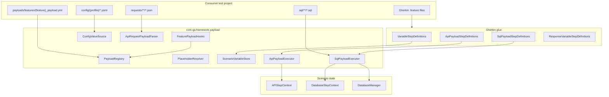
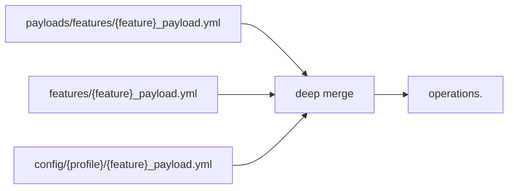
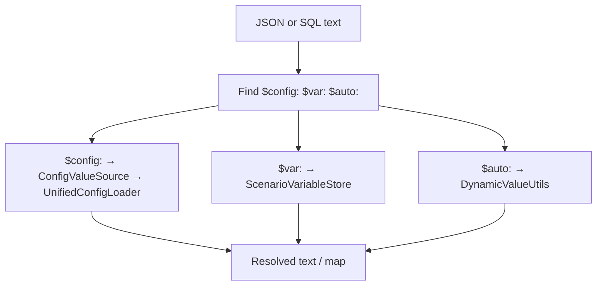
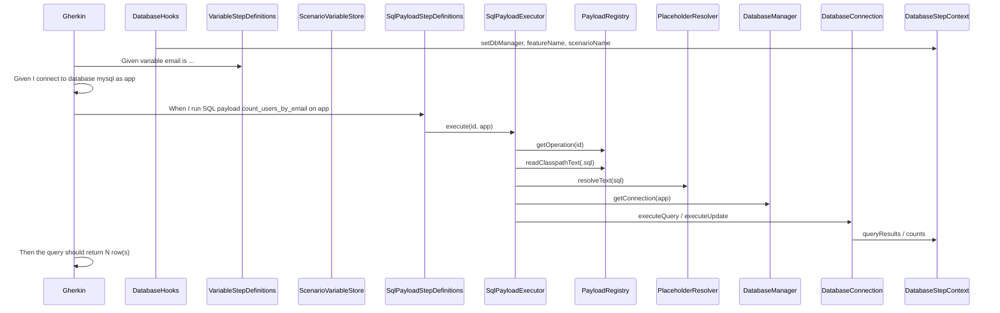
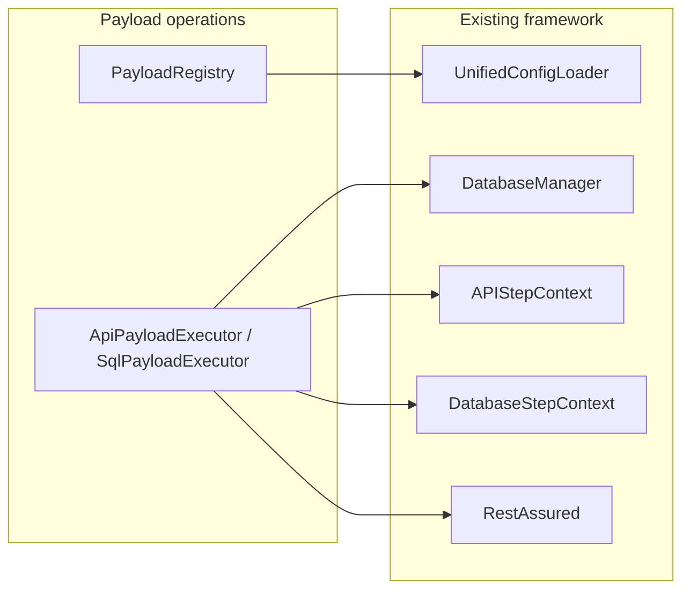

# Payload Operations Guide (API & DB)

This document describes how the **payload operations** design works in **Custom ACE Base Wrapper**: registry YAML, request/SQL files, placeholders (`$config:`, `$var:`, `$auto:`), Gherkin steps, Java classes, and test resources. A reader should be able to implement or adopt this design in another repo using the file lists and diagrams below.

**Scope:** API and DB (implemented). UI locator integration is planned separately; see [Future: UI](#future-ui-locators).

---

## Table of contents

1. [Concepts](#1-concepts)
2. [Architecture overview](#2-architecture-overview)
3. [API execution flow](#3-api-execution-flow)
4. [DB execution flow](#4-db-execution-flow)
5. [Placeholders](#5-placeholders)
6. [Gherkin steps (canonical)](#6-gherkin-steps-canonical)
7. [Test resources layout](#7-test-resources-layout)
8. [Java files required](#8-java-files-required)
9. [Dependencies on existing framework](#9-dependencies-on-existing-framework)
10. [Consumer test project checklist](#10-consumer-test-project-checklist)
11. [Examples](#11-examples)
12. [Legacy payload (still supported)](#12-legacy-payload-still-supported)
13. [Future: UI locators](#13-future-ui-locators)

---

## 1. Concepts

| Term | Meaning |
|------|--------|
| **Active feature** | Base name of the running `.feature` file (e.g. `users-api` from `users-api.feature`). Set in `FeaturePayloadHooks` before each scenario. |
| **Payload registry** | Merged `{feature}_payload.yml` containing an `operations:` section. |
| **Operation** | Named entry: `type` (`API` or `SQL`) + `file` (classpath path to JSON or `.sql`). |
| **Curl-like API JSON** | One file per HTTP call: `method`, `url`, `headers`, `body`. |
| **SQL file** | Plain SQL with `$config:` / `$var:` placeholders. |
| **Scenario variables** | Set only via Gherkin: `Given variable {name} is "{value}"` → `$var:name`. |
| **Config values** | Resolved automatically from `config/{profile}/` when `$config:dotted.path` appears in files. |

**Design rules**

- Do **not** add Gherkin steps to “load config” before API/SQL.
- Do **not** use DataTables on `When` steps for variables; use `Given variable …`.
- Connections for DB are still created explicitly (`Given I connect to database …`); payload only supplies SQL text.

---

## 2. Architecture overview

### 2.1 Layered components



### 2.2 Registry merge order



Later layers override earlier keys. Profile comes from `-Dprofile=local` (default `local`).

### 2.3 Placeholder resolution



---

## 3. API execution flow

### 3.1 Sequence diagram

```mermaid
sequenceDiagram
  participant G as Gherkin
  participant FPH as FeaturePayloadHooks
  participant PR as PayloadRegistry
  participant VS as VariableStepDefinitions
  participant SV as ScenarioVariableStore
  participant APS as ApiPayloadStepDefinitions
  participant EX as ApiPayloadExecutor
  participant PAR as ApiRequestPayloadParser
  participant PL as PlaceholderResolver
  participant CFG as ConfigValueSource
  participant RA as RestAssured
  participant CTX as APIStepContext
  participant THEN as APIResponseStatusStepDefinitions

  FPH->>PR: setActiveFeature(users-api)
  G->>VS: Given variable title is ...
  VS->>SV: set(title, value)
  G->>APS: When I send API payload create_post
  APS->>EX: execute(create_post)
  EX->>PR: getOperation(create_post)
  EX->>PAR: loadAndResolve(operation)
  PAR->>PR: readClasspathText(JSON)
  PAR->>PL: resolveMap(JSON)
  PL->>CFG: $config:...
  PL->>SV: $var:title
  PAR-->>EX: ApiRequestPayload
  EX->>RA: HTTP method + url + body
  RA-->>EX: Response
  EX->>CTX: setLastResponse(response)
  G->>THEN: Then the response status code should be 201
  THEN->>CTX: getLastResponse()
```

### 3.2 Class responsibilities (API path)

| Class | Purpose |
|-------|--------|
| `FeaturePayloadHooks` | `@Before`: set active feature on `PayloadRegistry`, clear `ScenarioVariableStore`. `@After`: clear caches. |
| `VariableStepDefinitions` | `Given variable {name} is "{value}"` → `ScenarioVariableStore`. |
| `ApiPayloadStepDefinitions` | `When I send API payload "{id}"` → `ApiPayloadExecutor`. |
| `PayloadRegistry` | Merge payload YAML; `getOperation(id)` → `PayloadOperation`. |
| `PayloadOperation` / `PayloadOperationType` | Model: id, `API`/`SQL`, file path. |
| `ApiRequestPayloadParser` | Load JSON; `PlaceholderResolver.resolveMap`; build `ApiRequestPayload`. |
| `PlaceholderResolver` | Replace `$config:`, `$var:`, `$auto:` in strings and nested maps. |
| `ConfigValueSource` | Resolve `$config:` via `UnifiedConfigLoader.loadMergedConfig(feature)`. |
| `ScenarioVariableStore` | Thread-local `$var:` values. |
| `ApiRequestPayload` | Resolved method, url, headers, body. |
| `ApiPayloadExecutor` | RestAssured call; `APIStepContext.setLastResponse`. |
| `APIStepContext` | Holds last `Response` for `Then` steps. |
| `APIResponseStatusStepDefinitions` | Assert status code on `lastResponse`. |
| `ResponseVariableStepDefinitions` | Optional: store JSON path into `$var:` for chained calls. |

### 3.3 API request JSON shape

Path: `src/test/resources/requests/{app}/{operation}.json` (classpath).

```json
{
  "method": "POST",
  "url": "$config:api.application.url$config:api.paths.users",
  "headers": {
    "Content-Type": "application/json"
  },
  "body": {
    "title": "$var:title",
    "body": "Demo text",
    "userId": 1
  }
}
```

- **url** may concatenate multiple `$config:` segments into one absolute URL.
- **body** may be a JSON object or string; RestAssured sends it as JSON for POST/PUT/PATCH.

---

## 4. DB execution flow

### 4.1 Sequence diagram



### 4.2 Class responsibilities (DB path)

| Class | Purpose |
|-------|--------|
| `DatabaseHooks` | Sets `DatabaseStepContext` (manager, feature/scenario names). Does **not** open connections. |
| `DatabaseConnectionStepDefinitions` | `Given I connect to database …` → `DatabaseManager` + JDBC `connect()`. |
| `SqlPayloadStepDefinitions` | `When I run SQL payload "{id}" on "{connection}"`. |
| `SqlPayloadExecutor` | Load SQL file, resolve placeholders, run on named connection, update `DatabaseStepContext`. |
| `DatabaseManager` | Named connection registry. |
| `DatabaseConnection` | JDBC executeQuery / executeUpdate. |
| `DatabaseStepContext` | `queryResults`, `updateCount`, `lastException`, etc. |
| `DatabaseSelectStepDefinitions` (etc.) | `Then` assertions on `queryResults`. |

**Note:** SQL payload does **not** create connections. Always connect in Gherkin before `When I run SQL payload …`.

### 4.3 SQL file shape

Path: `src/test/resources/sql/{app}/{name}.sql`

```sql
SELECT COUNT(*) AS user_count
FROM users
WHERE email = '$var:email'
  AND tenant_id = '$config:testData.tenantId'
```

Use quotes around `$var:` in SQL when the column expects a string literal.

---

## 5. Placeholders

| Syntax | Source | Gherkin setup? |
|--------|--------|----------------|
| `$config:api.application.url` | Merged `config/{profile}/master-config.yaml` + `{feature}-config.yaml` | **No** — automatic |
| `$var:email` | `ScenarioVariableStore` | **Yes** — `Given variable email is "..."` |
| `$auto:uuid` | `DynamicValueUtils` | **No** — generated at resolve time |

**Legacy:** `${vars.name}` and `${auto.uuid}` in old payload keys still work via `FeaturePayloadLoader` + `DynamicValueUtils`. New operations should prefer `$var:` and `$auto:`.

---

## 6. Gherkin steps (canonical)

### Variables

```gherkin
Given variable title is "My test post"
```

### API

```gherkin
When I send API payload "create_post"
Then the response status code should be 201
```

Optional chain:

```gherkin
Then I store response "$.id" as variable "orderId"
```

### DB

```gherkin
Given I connect to database "mysql" as "app"
And variable email is "john@example.com"
When I run SQL payload "count_users_by_email" on "app"
Then the query should return 1 row(s)
```

---

## 7. Test resources layout

```
src/test/resources/
├── config/
│   └── {profile}/
│       ├── master-config.yaml          # $config: targets (api, db, testData, secrets)
│       └── {feature}-config.yaml       # optional overrides
├── payloads/
│   └── features/
│       └── {feature}_payload.yml       # operations: registry
├── requests/
│   └── {app}/
│       └── *.json                      # curl-like API payloads
├── sql/
│   └── {app}/
│       └── *.sql                       # SQL payloads
└── features/
    └── {feature}.feature               # Gherkin (name must match payload stem)
```

**Naming rule:** `users-api.feature` → active feature `users-api` → loads `users-api_payload.yml`.

---

## 8. Java files required

### 8.1 Library JAR (`custom-ace-base-wrapper`) — payload package (implement once)

| File | Required | Role |
|------|----------|------|
| `payload/PayloadOperationType.java` | Yes | Enum `API`, `SQL` |
| `payload/PayloadOperation.java` | Yes | Operation model |
| `payload/PayloadRegistry.java` | Yes | Merge YAML, `getOperation`, read classpath files |
| `payload/PlaceholderResolver.java` | Yes | `$config:`, `$var:`, `$auto:` |
| `payload/ConfigValueSource.java` | Yes | Config lookup for `$config:` |
| `payload/ScenarioVariableStore.java` | Yes | `$var:` storage |
| `payload/ApiRequestPayload.java` | Yes | HTTP model |
| `payload/ApiRequestPayloadParser.java` | Yes | JSON → model + resolve |
| `payload/ApiPayloadExecutor.java` | Yes | RestAssured execution |
| `payload/SqlPayloadExecutor.java` | Yes | SQL execution |
| `payload/VariableStepDefinitions.java` | Yes | `Given variable …` |
| `payload/ApiPayloadStepDefinitions.java` | Yes | `When I send API payload …` |
| `payload/SqlPayloadStepDefinitions.java` | Yes | `When I run SQL payload …` |
| `payload/ResponseVariableStepDefinitions.java` | Optional | Store response → variable |
| `payload/FeaturePayloadHooks.java` | Yes | Active feature + clear state |

### 8.2 Library — supporting (already in project; do not duplicate)

| File | Role |
|------|------|
| `config/UnifiedConfigLoader.java` | Profile YAML merge for `$config:` |
| `db/DatabaseConfigLoader.java` | DB connection config (separate from SQL payload files) |
| `db/DatabaseManager.java` | Named connections |
| `db/DatabaseConnection.java` | JDBC |
| `stepdefinitions/db/DatabaseHooks.java` | DB scenario context |
| `stepdefinitions/db/DatabaseStepContext.java` | Query results, manager reference |
| `stepdefinitions/db/DatabaseConnectionStepDefinitions.java` | Connect steps |
| `stepdefinitions/db/DatabaseSelectStepDefinitions.java` | Then row assertions |
| `stepdefinitions/api/APIStepContext.java` | Last HTTP response |
| `stepdefinitions/api/APIHooks.java` | API config / base URL (optional if URL is full in JSON) |
| `stepdefinitions/api/APIResponseStatusStepDefinitions.java` | Status assertions |
| `utils/DynamicValueUtils.java` | `$auto:` and legacy `${vars.*}` |
| `exceptions/WrapperException.java` | Errors |

### 8.3 Library — legacy payload (optional; backward compatibility)

| File | Role |
|------|------|
| `payload/FeaturePayloadLoader.java` | Old `queries.*`, `bodies.*`, `paths.*` keys |
| `payload/FeaturePayloadBodyStepDefinitions.java` | `I set the body/SQL from feature payload` |
| `payload/PayloadStepContext.java` | Pending body/SQL between steps |
| `api/PayloadLoader.java` | Standalone `payloads/*.json` paths |
| `stepdefinitions/api/APIRequestStepDefinitions.java` | Path/body split steps |

New features should use **operations** only; legacy can remain until migration completes.

### 8.4 Library — tests (recommended)

| File | Role |
|------|------|
| `test/.../payload/PlaceholderResolverTest.java` | `$config:` / `$var:` |
| `test/.../payload/PayloadRegistryTest.java` | `operations` lookup |
| `test/.../payload/ApiRequestPayloadParserTest.java` | JSON resolve |
| `test/.../payload/FeaturePayloadLoaderTest.java` | Legacy loader |

### 8.5 Cucumber glue (runners)

Register package `com.qa.framework.payload` in your runner:

| Runner | Glue includes payload? |
|--------|-------------------------|
| `DBTestRunner` | `com.qa.framework.stepdefinitions.db,com.qa.framework.payload` |
| `UIAPITestNGRunner` | `com.qa.framework.payload` (with api, ui, ace-base glue) |
| `BaseTestRunner` | `com.qa.framework.payload` |

### 8.6 Consumer test project (per application under test)

No payload Java if using the JAR. Add only resources:

| Resource | Required |
|----------|----------|
| `{feature}_payload.yml` under `payloads/features/` | Yes |
| `requests/**/*.json` per API operation | Per API op |
| `sql/**/*.sql` per SQL operation | Per SQL op |
| `config/{profile}/master-config.yaml` | Yes |
| `features/{feature}.feature` | Yes |
| `pom.xml` dependency on `custom-ace-base-wrapper` | Yes |

---

## 9. Dependencies on existing framework



---

## 10. Consumer test project checklist

1. Add Maven dependency: `com.qa.framework:custom-ace-base-wrapper`.
2. Install JAR: `mvn clean install` in wrapper project.
3. Create `config/local/master-config.yaml` with `api`, `db`, `testData`, `secrets` as needed.
4. Create `payloads/features/{feature}_payload.yml` with `operations:` block.
5. Add JSON/SQL files referenced by `file:` paths.
6. Write feature file; tag `@API` / `@DB` per runner.
7. Run with `-Dprofile=local` (or dev/staging).
8. For DB: include `Given I connect to database …` before SQL payload steps.

---

## 11. Examples

### 11.1 Registry — `users-api_payload.yml`

```yaml
operations:
  create_post:
    type: API
    file: requests/users-api/create-post.json
  get_users:
    type: API
    file: requests/users-api/get-users.json
  count_users_by_email:
    type: SQL
    file: sql/users-api/count-users.sql
```

### 11.2 Feature — `payload-operations-api.feature`

```gherkin
@API
Feature: Payload operations API demo

  Scenario: Create post with variable in body
    Given variable title is "My test post"
    When I send API payload "create_post"
    Then the response status code should be 201

  Scenario: List users via GET payload
    When I send API payload "get_users"
    Then the response status code should be 200
```

### 11.3 Sample files in this repo

| Path | Description |
|------|-------------|
| `src/test/resources/requests/users-api/create-post.json` | POST with `$config:` URL and `$var:title` |
| `src/test/resources/requests/users-api/get-users.json` | GET users |
| `src/test/resources/sql/users-api/count-users.sql` | SELECT with `$var:email` |
| `src/test/resources/features/payload-operations-api.feature` | API demo |
| `src/test/resources/features/payload-operations-sql.feature` | SQL demo (`@DB`) |

---

## 12. Legacy payload (still supported)

| Approach | Gherkin example | Config location |
|----------|-----------------|-----------------|
| Feature payload keys | `When I set the body from feature payload "bodies.create_user"` | `bodies`, `paths`, `queries` in `{feature}_payload.yml` |
| Split API steps | `When I send a POST request to path from feature payload "paths.users"` | Same YAML |
| Standalone JSON | `payloads/user/create-user.json` via `PayloadLoader` | Path in step string |

**Operations registry** is the recommended approach for new work.

---

## 13. Future: UI locators

Planned extension (not implemented in code yet):

- `{feature}_locators.yml` or `ui.locatorFile` in payload YAML.
- `operations.<id>` with `type: UI`.
- Generic steps: `When I click "login.submit"`, `Given variable …`, same `$config:` / `$var:` rules.
- Logical `pages.*` for multi-page apps; see team design notes for UI flow.

---

## Quick reference card

| I want to… | Gherkin | File |
|------------|---------|------|
| Set test data | `Given variable x is "y"` | — |
| Call API | `When I send API payload "op_id"` | `operations.op_id` → JSON |
| Run SQL | `When I run SQL payload "op_id" on "conn"` | `operations.op_id` → `.sql` |
| Assert HTTP status | `Then the response status code should be 201` | — |
| Assert SQL rows | `Then the query should return 1 row(s)` | — |
| Use config URL/secret | Put `$config:api.application.url` in JSON/SQL | `config/{profile}/master-config.yaml` |

---

**Document version:** 1.0  
**Library artifact:** `com.qa.framework:custom-ace-base-wrapper`  
**Related docs:** `FEATURE_PAYLOAD.md` (legacy keys), `CONFIGURATION.md`, `API_ARCHITECTURE.md`
